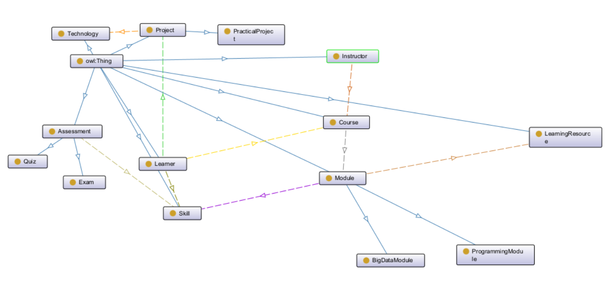

# Notre projet d'ontologie
# 🧠 Ontologie du domaine Éducation – Data Engineering

## 🎯 Domaine choisi

Le domaine choisi pour ce projet est celui de **l’éducation**, avec un focus spécifique sur le **Data Engineering** (ou ingénierie des données). Il s'agit d'un sous-domaine des sciences informatiques qui forme des étudiants aux compétences en manipulation, traitement, stockage et analyse de grandes quantités de données.

## ✅ Justification du choix

Le choix du domaine **Éducation – Data Engineering** s'explique par plusieurs raisons :

- 🎓 **Alignement académique** : Le sujet est en cohérence avec notre formation actuelle en informatique, ce qui facilite la compréhension des concepts à modéliser.
- 📊 **Richesse conceptuelle** : Le domaine permet de relier des entités variées (cours, compétences, enseignants, projets, technologies, etc.) tout en ayant une structure logique exploitable en ontologie.
- 🧠 **Utilité pédagogique** : Une telle ontologie pourrait servir à :
  - recommander des parcours d’apprentissage adaptés aux compétences acquises,
  - structurer des ressources pédagogiques selon leur type, difficulté ou technologie utilisée,
  - suivre l’évolution des apprenants et leurs progrès dans l’acquisition de compétences en Data Engineering.

## 🧠 Concepts clés identifiés

### 🔷 **Classes principales**

| Classe            | Description                                              |
|-------------------|----------------------------------------------------------|
| `Learner`         | Représente un apprenant inscrit dans un programme.       |
| `Instructor`      | Personne responsable d’un cours ou module.              |
| `Course`          | Unité d’enseignement regroupant plusieurs modules.      |
| `Module`          | Partie spécifique d’un cours (ex: Python, Hadoop…).      |
| `Skill`           | Compétence technique ou théorique à acquérir.           |
| `Assessment`      | Évaluation liée à une compétence ou un cours.           |
| `LearningResource`| Ressource pédagogique (vidéo, document, lien, etc.).    |
| `Project`         | Cas pratique ou projet développé par un apprenant.      |
| `Technology`      | Outil, framework ou langage utilisé dans les cours.     |

### 🔸 **Sous-classes proposées**

| Sous-classe        | Super-classe   | Description                                      |
|--------------------|----------------|--------------------------------------------------|
| `BigDataModule`    | `Module`       | Modules axés sur les frameworks Big Data (Hadoop, Spark…) |
| `ProgrammingModule`| `Module`       | Modules de programmation (Python, Scala, etc.)  |
| `Quiz`             | `Assessment`   | Évaluations rapides de type QCM.                |
| `Exam`             | `Assessment`   | Épreuves longues et formelles.                  |
| `PracticalProject` | `Project`      | Projets appliqués à des cas réels ou simulés.   |
## 🔗 Relations entre les concepts (propriétés)

Voici les principales relations définies entre les classes de l’ontologie :

| Propriété          | Domaine → Portée            | Description                                                      |
|--------------------|-----------------------------|------------------------------------------------------------------|
| `teaches`          | `Instructor → Course`        | L’enseignant donne un cours                                      |
| `enrolledIn`       | `Learner → Course`           | L’apprenant est inscrit à un cours                               |
| `includesModule`   | `Course → Module`            | Le cours est composé de plusieurs modules                        |
| `coversSkill`      | `Module → Skill`             | Le module enseigne une ou plusieurs compétences                  |
| `assesses`         | `Assessment → Skill`         | L’évaluation mesure une compétence particulière                  |
| `achievedSkill`    | `Learner → Skill`            | Compétence acquise par l’apprenant                               |
| `producesProject`  | `Learner → Project`          | L’apprenant réalise un projet                                    |
| `usesTechnology`   | `Project → Technology`       | Le projet utilise des technologies spécifiques                   |
| `hasResource`      | `Module → LearningResource`  | Le module est accompagné de ressources pédagogiques              |

## 🌐 Namespaces utilisés

Afin d'assurer la compatibilité avec les standards du Web sémantique, les namespaces suivants seront utilisés dans notre ontologie :

| Préfixe | URI | Utilisation prévue |
|--------|-----|--------------------|
| `rdf:` | `http://www.w3.org/1999/02/22-rdf-syntax-ns#` | Syntaxe RDF de base |
| `rdfs:` | `http://www.w3.org/2000/01/rdf-schema#` | Définition de classes et propriétés |
| `xsd:` | `http://www.w3.org/2001/XMLSchema#` | Types de données (string, int, date...) |
| `owl:` | `http://www.w3.org/2002/07/owl#` | Modélisation OWL pour classes, restrictions |
| `foaf:` | `http://xmlns.com/foaf/0.1/` | Pour les personnes (`Learner`, `Instructor`) |
| `dc:` | `http://purl.org/dc/elements/1.1/` | Métadonnées (titre, créateur, date…) |
| `skos:` | `http://www.w3.org/2004/02/skos/core#` | Vocabulaire hiérarchique ou thématique (ex: catégories de modules) |


## 🖼️ Visualisation de l’ontologie

## 📊 Requêtes SPARQL exécutées avec résultats

### 🔁 Préfixes utilisés dans toutes les requêtes :
```sparql
PREFIX : <http://www.education-ontology.org/education-data-engineering#>
PREFIX rdf: <http://www.w3.org/1999/02/22-rdf-syntax-ns#>
```

---


### ✅ Requête 1 – Apprenants, leurs projets et les technologies utilisées
```sparql
SELECT ?learner ?project ?technology
WHERE {
  ?learner rdf:type :Learner .
  ?learner :producesProject ?project .
  ?project :usesTechnology ?technology .
}
```
| learner  | project               | technology |
|----------|-----------------------|------------|
| Oussema  | Data Analysis Project | Python     |

---

### ✅ Requête 2 – Modules, compétences couvertes et ressources pédagogiques
```sparql
SELECT ?module ?skill ?resource
WHERE {
  ?module :coversSkill ?skill .
  ?module :hasResource ?resource .
  ?module rdf:type :ProgrammingModule .
}
```
| module         | skill         | resource             |
|----------------|---------------|----------------------|
| Python Module  | Python Basics | Intro to Python PDF  |

---

### ✅ Requête 3 – Enseignants, cours enseignés, modules inclus
```sparql
SELECT ?instructor ?course ?module
WHERE {
  ?instructor :teaches ?course .
  ?course :includesModule ?module .
  ?instructor rdf:type :Instructor .
}
```
| instructor   | course                 | module         |
|--------------|------------------------|----------------|
| MrBenSalah   | Data Engineering Course | Spark Module   |
| MrBenSalah   | Data Engineering Course | Python Module  |

---

### ✅ Requête 4 – Apprenants, cours suivis, modules associés
```sparql
SELECT ?learner ?course ?module
WHERE {
  ?learner :enrolledIn ?course .
  ?course :includesModule ?module .
  ?learner rdf:type :Learner .
}
```
| learner   | course                 | module         |
|-----------|------------------------|----------------|
| Oussema   | Data Engineering Course | Spark Module   |
| Oussema   | Data Engineering Course | Python Module  |


